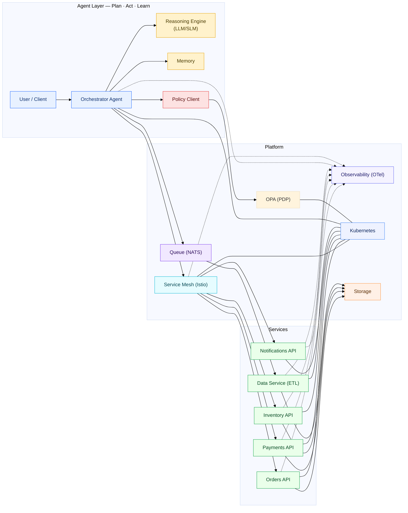
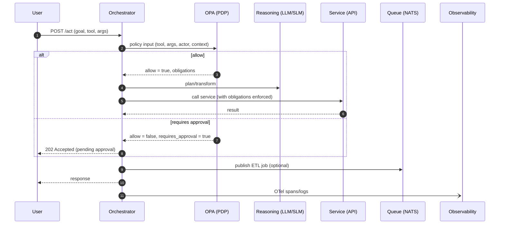
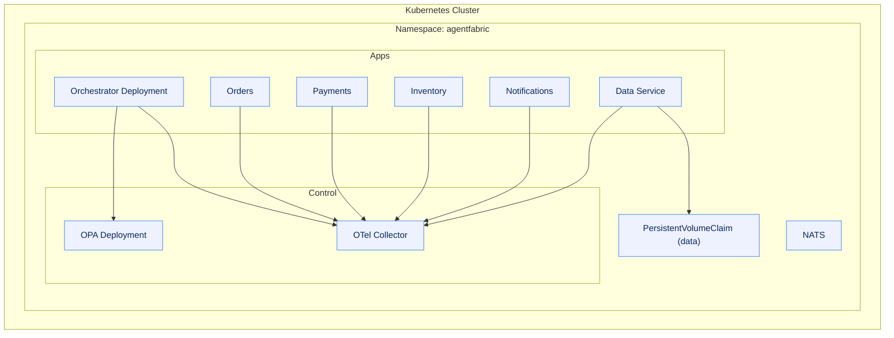

# AgentFabric — *weave agents, services, and policy into one stack*

AgentFabric is a modular, cloud‑native framework for building **agentic applications** that talk to **domain services** (Orders, Payments, Inventory, Notifications), run in **Kubernetes**, and are governed by **policy** (OPA/Rego). It couples **observability** (OTel), **service mesh**, and a **queue + ETL** lane for durable workflows.

> **Why**: Most agent apps need more than a model—they need **routing, guardrails, approvals, audit, and service contracts**. AgentFabric supplies the fabric.

---

## Highlights
- **Agent layer**: Orchestrator + Reasoning Engine (LLM/SLM), Memory, and Policy checks (OPA).
- **Service layer**: REST microservices for Orders, Payments, Inventory, Notifications.
- **Platform layer**: Kubernetes, Service Mesh (Istio), NATS (queue), Storage, Observability (OTel).
- **Governance**: Externalized decisions (PDP), obligations (e.g., redact PII), audit trails.
- **MCP**: Optional Model Context Protocol server to expose tools/resources to agents.

---

## Quick start (Docker Compose)
```bash
# From the repo root
docker compose up -d --build
# Or bring up OPA first:
docker compose up -d opa
```

**Health checks**
- OPA (PowerShell): `curl.exe "http://localhost:8181/health?plugins&bundles"`  
- OPA (CMD): `curl http://localhost:8181/health?plugins^&bundles`

---

## Architecture (System Overview)



---

## Governance & Policy (OPA/Rego)

```mermaid
flowchart LR
  subgraph Request
    RQ["Action Request<br/>(tool + args + actor + context)"]
  end
  RQ --> PDPC["Policy Client"]
  PDPC --> OPA["OPA (PDP)"]
  OPA -->|allow/deny + obligations| PDPC
  PDPC -->|enforce obligations (e.g., redact)| EXEC["Executor / Router"]
  EXEC --> SVC["Domain Service"]
  SVC --> AUD["Audit / OTel Spans"]

  classDef policy fill:#fde2e2,stroke:#e63b3b,color:#5a0c0c;
  classDef svc fill:#eaffea,stroke:#16a34a,color:#064b23;
  classDef obs fill:#f5f3ff,stroke:#6366f1,color:#1f1b6b;
  class PDPC,OPA policy;
  class SVC,AUD obs;
```

**Example policy (`policy/policy.rego`)**

```rego
package agent

default allow = false

# Simple allow for smoke tests
allow { input.tool == "ping" }

# Example: payments guard
deny[msg] {
  input.tool == "charge_payment"
  input.args.amount > 1000
  msg := "amount exceeds limit; approval required"
}

requires_approval {
  input.tool == "charge_payment"
  input.args.amount > 1000
}
```

The orchestrator queries: `POST /v1/data/agent/allow` and can also read auxiliary data (e.g., `requires_approval`).

---

## Orchestration Sequence



---

## Deployment Topology (K8s)



---

## Configuration

- **OPA endpoint**: `OPA_URL=http://opa:8181/v1/data/agent/allow`  
- **OTel**: `OTEL_EXPORTER_OTLP_ENDPOINT=http://otel-collector:4318`  
- **Service URLs**: `ORDERS_URL`, `PAYMENTS_URL`, `INVENTORY_URL`, `NOTIFY_URL`  
- **Queue**: `NATS_URL=nats://nats:4222`

**Compose OPA snippet**
```yaml
opa:
  image: openpolicyagent/opa:0.67.0
  command: ["run","--server","--addr=:8181","/policy"]
  volumes:
    - ./policy:/policy:ro
  ports:
    - "8181:8181"
```

---

## Author
**Freeman Augustus Jackson** — Maintainer & original author.  
Issues and contributions welcome at https://github.com/4th/AgenticFabric

## License
Apache‑2.0
