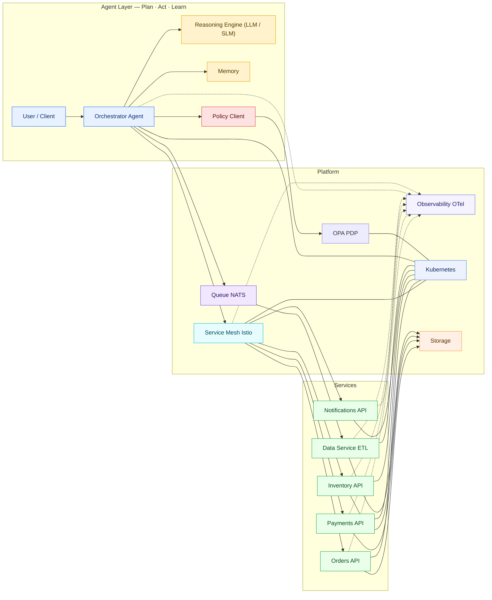
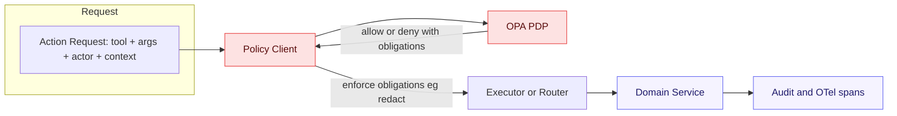
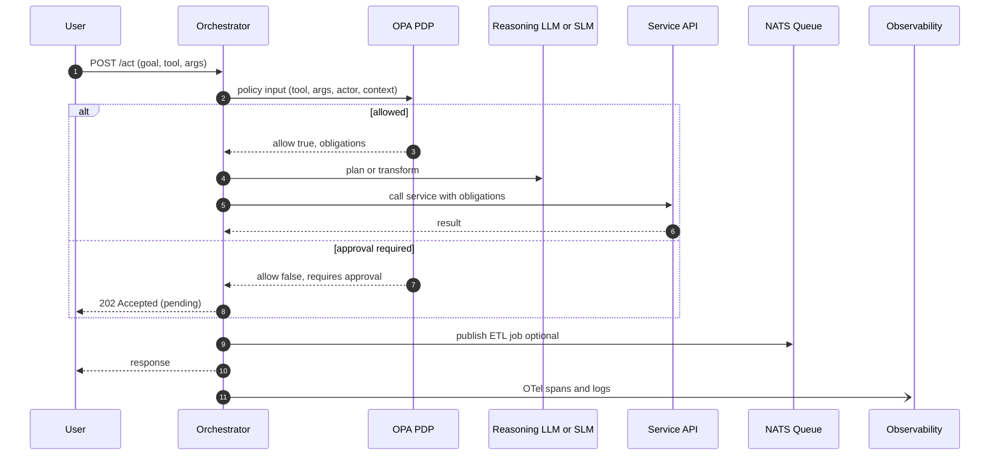
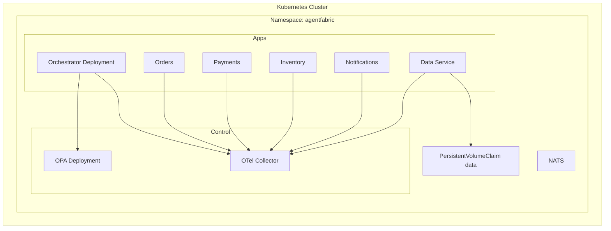

# AgentFabric — *weave agents, services, and policy into one stack*

AgentFabric is a modular, cloud-native framework for building **agentic applications** that talk to **domain services** (Orders, Payments, Inventory, Notifications), run in **Kubernetes** (The Kubernetes Authors, n.d.), and are governed by **policy** via **OPA/Rego** (Open Policy Agent, n.d.). It couples **observability** with **OpenTelemetry** (OpenTelemetry Authors, n.d.), an optional **service mesh** such as **Istio** (Istio Authors, n.d.), and a **queue + ETL** lane using **NATS** (Synadia Communications, n.d.). It can expose tools/resources to agents through the **Model Context Protocol (MCP)** (OpenAI, n.d.).

> **Why**: Most agent apps need more than a model—they need **routing, guardrails, approvals, audit, and service contracts**. AgentFabric supplies the fabric.

---

## Highlights
- **Agent layer**: Orchestrator + Reasoning Engine (LLM/SLM), Memory, and Policy checks with OPA (Open Policy Agent, n.d.).
- **Service layer**: REST microservices for Orders, Payments, Inventory, Notifications.
- **Platform layer**: Kubernetes (The Kubernetes Authors, n.d.), Service Mesh e.g., Istio (Istio Authors, n.d.), NATS queue (Synadia Communications, n.d.), Storage, Observability with OpenTelemetry (OpenTelemetry Authors, n.d.).
- **Governance**: Externalized decisions (PDP), obligations such as PII redaction, audit trails (Open Policy Agent, n.d.; OpenTelemetry Authors, n.d.).
- **MCP**: Optional Model Context Protocol server to expose tools/resources to agents (OpenAI, n.d.).

---

## Quick start (Docker Compose)
```bash
# From the repo root
docker compose up -d --build
# Or bring up OPA first:
docker compose up -d opa
```

**Health checks**
- OPA (PowerShell): `curl.exe "http://localhost:8181/health?plugins&bundles"`  
- OPA (CMD): `curl http://localhost:8181/health?plugins^&bundles`

---

## Architecture (System Overview)



---

## Governance & Policy (OPA/Rego)



**Example policy (`policy/policy.rego`)**
```rego
package agent

default allow = false

# Simple allow for smoke tests
allow {
  input.tool == "ping"
}

# Example: payments guard
deny[msg] {
  input.tool == "charge_payment"
  input.args.amount > 1000
  msg := "amount exceeds limit; approval required"
}

requires_approval {
  input.tool == "charge_payment"
  input.args.amount > 1000
}
```

The orchestrator queries: `POST /v1/data/agent/allow` and can also read auxiliary data (e.g., `requires_approval`) (Open Policy Agent, n.d.).

---

## Orchestration Sequence



---

## Deployment Topology (K8s)



---

## Configuration

- **OPA endpoint**: `OPA_URL=http://opa:8181/v1/data/agent/allow`  
- **OTel**: `OTEL_EXPORTER_OTLP_ENDPOINT=http://otel-collector:4318`  
- **Service URLs**: `ORDERS_URL`, `PAYMENTS_URL`, `INVENTORY_URL`, `NOTIFY_URL`  
- **Queue**: `NATS_URL=nats://nats:4222`

**Compose OPA snippet**
```yaml
opa:
  image: openpolicyagent/opa:0.67.0
  command: ["run","--server","--addr=:8181","/policy"]
  volumes:
    - ./policy:/policy:ro
  ports:
    - "8181:8181"
```

---

## References (APA)

- Istio Authors. (n.d.). *Istio documentation*. https://istio.io/latest/docs/
- OpenAI. (n.d.). *Model Context Protocol (MCP)*. https://github.com/modelcontextprotocol
- Open Policy Agent. (n.d.). *OPA documentation*. https://www.openpolicyagent.org/docs/latest/
- OpenTelemetry Authors. (n.d.). *OpenTelemetry documentation*. https://opentelemetry.io/docs/
- Synadia Communications, Inc. (n.d.). *NATS documentation*. https://docs.nats.io/
- The Kubernetes Authors. (n.d.). *Kubernetes documentation*. https://kubernetes.io/docs/

---

## Author
**Freeman Augustus Jackson** — Maintainer & original author.  
Issues and contributions welcome at https://github.com/4th/AgenticFabric

## License
Apache-2.0
